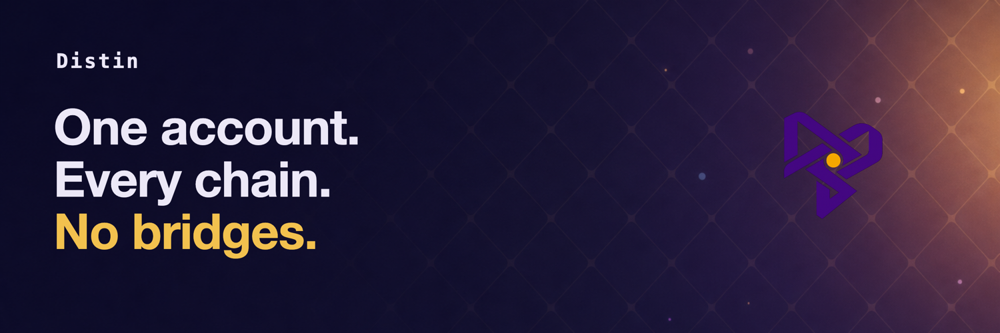

# Distin

**One Solana account. Every chain. No bridges.**

Distin turns Solana into a control plane for cross-chain signing. Instead of wrapping an asset into a bridged IOU, a quorum of bonded operators runs a real threshold-signature ceremony off-chain and produces a *native* signature for the destination chain — coordinated, accounted, and slashed entirely by an on-chain Anchor program. The destination chain (Ethereum, Bitcoin, Tron, Solana, Cosmos) sees an ordinary signature over its own curve. No bridge contract, no wrapped asset, no honeypot to drain.

The hard part is the cryptography, so this README leads with it. You can verify the core claim yourself in about two minutes.

---

## Prove it yourself

The central claim is: **`t` of `n` operators, each holding only a key share, produce one signature that an independent, standard verifier accepts — and the group secret is never reconstructed.** Two commands prove it on two curves. No devnet, no validator, no API keys.

### 1. FROST Ed25519 — the SVM / Cosmos curve (Rust)

```bash
cd engine/kobe
cargo test
```

This runs a 2-of-3 FROST Ed25519 ceremony (keygen → round 1 → round 2 → aggregate) and verifies the result two ways: under FROST's own verify path **and** under the independent `ed25519-dalek` crate — the exact RFC 8032 primitive a Solana or Cosmos chain runs. It also asserts the negative cases (wrong message, tampered signature, wrong group key, sub-threshold quorum) all fail, so a green test can't be a false positive.

```
running 3 tests
test one_share_cannot_sign - should panic ... ok
test two_of_three_aggregate_is_a_valid_ed25519_signature ... ok
test any_two_of_three_quorum_verifies ... ok

test result: ok. 3 passed; 0 failed; 0 ignored; 0 measured; 0 filtered out
```

Want to see the bytes? `cargo run --example frost_demo` prints the group public key and the 64-byte signature, then the independent-verifier line:

```
parties      : 3, threshold : 2
signing quorum: participants {1, 2}  (party 3 stays offline)
group pubkey : 25d245e6f9923f6025baf9aa031a56a77215ff32c18aba1421065e26cf0b2e29
signature(64): 73b959adfcd616a3e43a44fafdc3f46862abb52997de77ab0a3a4f82b5b9adb1...

independent ed25519-dalek verify against the group key:
VERIFIED — 2 of 3 shares produced a valid standard Ed25519 signature,
           and the group secret was never reconstructed.
```

(The key and signature differ on every run — keygen draws fresh randomness each time. What's invariant is the `VERIFIED` line.)

### 2. GG20 threshold ECDSA — the EVM / BTC / Tron curve (Go)

```bash
cd engine/kobe-ecdsa
go test -v -timeout 600s    # ~110s total; GG20 safe-prime DKG is genuinely slow
```

This runs 2-of-3 GG20 threshold ECDSA over secp256k1 and proves the output is natively chain-valid on three chains, each with an *independent* verifier:

- **Ethereum** — the `(r,s,v)` recovers, via go-ethereum's own `Ecrecover`, to the same address derived from the group public key. That is exactly the check an ETH node performs.
- **Bitcoin** — a BIP-143 sighash is threshold-signed, DER + `SIGHASH_ALL` encoded, and verified under **decred secp256k1** (a different library than the one that signed). P2WPKH bech32 derivation matches the BIP-173 spec vector; low-S (BIP-62) enforced.
- **Tron** — keccak → `0x41` → base58check derivation is cross-checked against a known vector; the `(r,s,v)` recovers to the same Tron address.

```
--- PASS: TestBtcP2WPKHKnownVector (0.00s)        bc1qw508...kv8f3t4 (matches BIP-173 vector)
--- PASS: TestBtcThresholdSignVerifies (21.81s)   decred secp256k1 ACCEPTED the DER signature
--- PASS: TestBtcDERIsLowS (18.50s)               low-S (BIP-62 canonical)
--- PASS: TestTronAddressKnownVector (0.00s)      TMVQGm1q...uHK2HC (matches known vector)
--- PASS: TestTronThresholdSignRecovers (24.70s)  recovered Tron address MATCHES the group
--- PASS: TestTwoOfThreeRecoversGroupEthAddress   RECOVERED ADDRESS MATCHES
--- PASS: TestAnyTwoOfThreeQuorum (14.32s)         all three 2-of-3 quorums recover the group
--- PASS: TestSignatureIsEthWireFormat (16.22s)    go-ethereum VerifySignature accepts it
PASS
ok  	github.com/distin/kobe-ecdsa	107.719s
```

That's the whole thesis, reproducible from a clean clone: shares in, one chain-valid signature out, verified by the destination chain's own primitive — never the secret key.

---

## What's real vs what's next

Honesty is the point. Here is the exact line between what is built and verified and what is not.

**Real — built and independently verified (M1–M7):**

- **FROST Ed25519 (M1).** 2-of-3 threshold Schnorr over Ed25519 via the ZF `frost-ed25519` 3.0 crate; aggregate verified by `ed25519-dalek`. (`engine/kobe`)
- **GG20 threshold ECDSA (M2).** 2-of-3 over secp256k1 via Binance `tss-lib` v2; ecrecover-verified by go-ethereum. (`engine/kobe-ecdsa`)
- **Bitcoin + Tron (M5/M6).** Real BIP-143 sighash signing, DER/bech32/base58check envelopes, verified against independent libraries and spec vectors.
- **On-chain coordination loop (M3/M4).** An on-chain `SigningRequest` drives the off-chain MPC; the real aggregate is recorded back on-chain and independently verified, end-to-end on a local validator. (`engine/coordinator`)
- **Networked operators (M7).** Three separate OS processes (distinct PIDs, ports, Ed25519 identity keys, share files) run the GG20 DKG and a 2-of-3 sign over authenticated TCP; an on-chain request triggers it; the wire signature ecrecover-verifies to the group address. (`engine/kobe-ecdsa/net`, `engine/coordinator` `net-demo`)
- **On-chain program, reconciled.** The fake byte-fold "signature" was removed; `aggregate_and_emit` now takes the *real* off-chain aggregate as input and enforces threshold + slot deadline. Operator lifecycle, bonding, and slashing are implemented in full. (`engine/programs/distin`)

**Next — not done, and not claimed to be:**

- **Devnet redeploy of the reconciled program.** An earlier build of the program is on devnet at the ID below, but the *reconciled* bytecode (real-aggregate input, `cancel_request` authority fix) has **not** been redeployed yet — that needs operator SOL. Treat the current devnet account as stale until redeployed.
- **Networked-operator hardening.** Today's network proof is localhost: no TLS, no PKI/CA (a static pinned-key directory), and a fail-stop abort rather than GG20 *identifiable* abort (it does not yet attribute and slash the misbehaving operator). Shares live in local files, not an HSM.
- **Security audit.** `tss-lib` and `frost-ed25519` are audited; *this integration and the on-chain program are not*. Nothing here is audited for real value.
- **FROST networked path.** Only the GG20/ETH path is proven networked end-to-end; the FROST signer follows the identical wiring but its `net/` operator isn't built yet.

No partners, no audit badge, no live token. When those exist, they'll be here.

---

## Architecture

```
                       ON-CHAIN (Solana, the control plane)
   ┌──────────────────────────────────────────────────────────────────┐
   │  Anchor program  engine/programs/distin                           │
   │                                                                   │
   │  initialize ─ register_operator(bond LST) ─ create_signing_request │
   │       │                                              │            │
   │       │  threshold_bps of bonded stake               │ SigningRequest PDA
   │       ▼                                              ▼  (intent: target VM,
   │  submit_partial_signature × t  ──►  aggregate_and_emit   32-byte msg hash,
   │  (participation / stake receipts)   (records REAL agg)   scheme, deadline)
   └───────────────▲──────────────────────────────┬───────────────────┘
                   │ records the aggregate         │ reads message_hash
                   │                               ▼
   ┌───────────────┴───────────────────────────────────────────────────┐
   │  OFF-CHAIN MPC  (the cryptography — never reconstructs the secret) │
   │                                                                   │
   │   FROST Ed25519        GG20 ECDSA secp256k1                        │
   │   engine/kobe (Rust)   engine/kobe-ecdsa (Go) ── net/ operators    │
   │        │                     │                  over TCP, Ed25519- │
   │        ▼                     ▼                  authenticated      │
   │   1 Ed25519 sig         1 (r,s,v) sig                              │
   └────────┬─────────────────────┬────────────────────────────────────┘
            │                     │
            ▼                     ▼
   INDEPENDENT VERIFIER (the destination chain's own primitive)
   ed25519-dalek / OpenSSL       go-ethereum Ecrecover / decred secp256k1
   (Solana, Cosmos)              (Ethereum, Bitcoin, Tron)
```

Three layers, three responsibilities:

1. **On-chain coordinator** (`engine/programs/distin`). Owns accounting, economic security, threshold enforcement, liveness deadlines, and slashing. It does *not* do cryptography — it records a 32-byte intent and, later, the real aggregate bytes, gating on staked weight and a slot deadline.
2. **Off-chain MPC** (`engine/kobe`, `engine/kobe-ecdsa`). The actual ceremony. Each operator holds one Shamir share; the protocol combines partial signatures into one signature without ever reconstructing the group secret. FROST is 3-round, GG20 ~6-round — which is why a 400ms-slot chain hosts the coordination and slow-finality chains can't.
3. **Independent verifier.** The destination chain. It receives a signature indistinguishable from one a single key produced, and verifies it with its own native primitive.

### Why Solana hosts coordination

Multi-round MPC needs several network round-trips between operators. On a 12–15s chain each round costs over a minute; on Solana's 400ms slots an interactive ceremony finishes in seconds of wall-clock time. The control plane lives where coordination is cheap; the signature lands wherever it's needed.

### Signature schemes, branched per destination VM

| `TargetVm` | `SignatureScheme` | Off-chain signer |
|---|---|---|
| `Svm` / `Cosmos` | `FrostEd25519` (FROST Schnorr, Ed25519) | `engine/kobe` |
| `Evm` / `Bitcoin` | `Gg20Secp256k1` (GG20 threshold ECDSA, secp256k1) | `engine/kobe-ecdsa` |
| `Tron` | `Gg20Secp256k1` | `engine/kobe-ecdsa` |

The scheme is fixed on the request at creation and is immutable; a mismatched partial is rejected with `SchemeMismatch`.

### Economic security

Operators are the signing set. Each bonds an LST (Token-2022) into a protocol-owned `bond_vault` as slashable collateral before they can sign. Once collected partial-signature weight crosses `threshold_bps` of total bonded stake, any caller can finalize; the admin can slash a misbehaving operator's bond into a `slash_pool`; operators unbond through a cooldown. (Until a Pyth feed is wired, the bond mint is treated as a 1:1 SOL-pegged LST so accounting stays exact — the integration point is marked in-source.)

---

## Repository layout

| Path | What's there |
|---|---|
| `engine/kobe/` | FROST Ed25519 threshold signer (Rust, ZF `frost-ed25519`). The SVM/Cosmos curve. `cargo test` is proof #1. |
| `engine/kobe-ecdsa/` | GG20 threshold ECDSA signer (Go, Binance `tss-lib`) + BTC/Tron envelopes + networked operators (`net/`, `cmd/operator`). The EVM/BTC/Tron curve. `go test` is proof #2. |
| `engine/coordinator/` | The on-chain → MPC → on-chain loop (Rust). `m7-demo.sh` runs the networked capstone on a local validator. |
| `engine/programs/distin/` | The Anchor program: config, operator lifecycle, request/partial/aggregate flow, slashing. Anchor 0.31, Token-2022. |
| `web/` | The Next.js 16 site (App Router, Tailwind, R3F hero). |
| `docs/` | Protocol documentation (`.mdx`): architecture, how-it-works, security, API reference. |
| `marketing/` | Launch copy and assets. |

Security model and threat boundary: [`engine/SECURITY.md`](engine/SECURITY.md). Engine self-audit: [`engine/AUDIT.md`](engine/AUDIT.md).

---

## Build & test

### Off-chain signers (the proofs above)

```bash
cd engine/kobe       && cargo test                    # FROST Ed25519, ~10s
cd engine/kobe-ecdsa && go test -v -timeout 600s      # GG20 ECDSA (ETH/BTC/Tron), ~110s
```

### On-chain program

```bash
cd engine
cargo test --manifest-path programs/distin/Cargo.toml   # 12 host tests: share validation + threshold math
cargo fmt --all -- --check
anchor build                                            # SBF build (needs the Solana toolchain)
```

The full on-chain → MPC → on-chain loop on a local validator:

```bash
cd engine/coordinator && ./m7-demo.sh   # stands up a fresh validator, runs the networked capstone, tears it down
```

Deploy (devnet first; mainnet is gated behind a verified devnet run):

```bash
cd engine
bash deploy.sh devnet
```

Program ID (declared for every cluster in `engine/Anchor.toml`):
`2KNozrxEXtW6bzm741Egw4R79B8AnxX33yJG5rkJAHUd`

An earlier build is on devnet at that ID. The reconciled bytecode has not been redeployed yet (see *What's next*).

### Site

```bash
cd web
npm install
npm run build
npm run dev      # http://localhost:3000
```

---

## License

[MIT](LICENSE)
